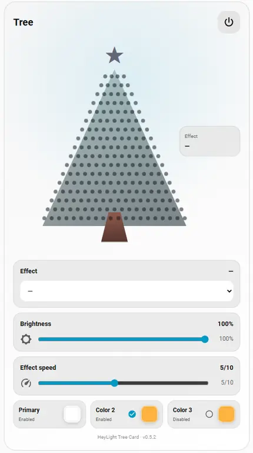
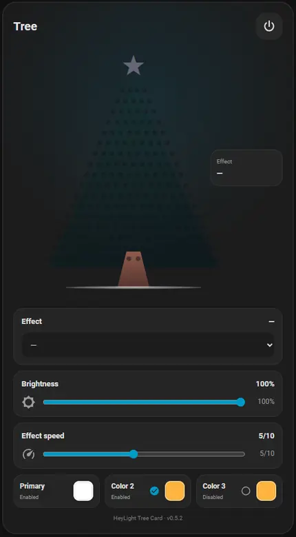

# HeyLight for Home Assistant

A local Home Assistant integration for **HeyLight / Telink Bluetooth Mesh Christmas light strings**, developed and physically tested with a **DekorTrend HeyLight Christmas-tree light set**.

> **Project status: BETA**  
> The integration is still under active development, but the core features are working on the tested DekorTrend HeyLight hardware: power, effects, colours, brightness, effect speed, device-side timing and the bundled animated dashboard card.

This is an independent interoperability project and is **not affiliated with HeyLight, DekorTrend, Telink or Home Assistant**.

## What this project does

The official HeyLight application uses Bluetooth SIG Mesh with Telink vendor commands to control the light string. This integration can either **import an existing HeyLight mesh** from the app or **create and manage a new Bluetooth Mesh network directly in Home Assistant**, then control the lights locally over Bluetooth without requiring the HeyLight cloud for normal operation.

After setup, Home Assistant can expose the light as normal entities and the bundled **HeyLight Tree** card provides a visual controller that follows the selected effect and colours.

## Real Home Assistant dashboard card

<p align="center">
  
  
</p>

The card includes:

- power control with state feedback
- animated Christmas-tree preview
- current effect display and effect selector
- brightness control
- effect speed control
- primary effect colour
- optional second and third effect colours where supported by the selected effect
- effect-specific animations modelled after the behaviour of the original HeyLight app
- automatic discovery of the extra colour and speed entities belonging to the same device
- responsive mobile layout

The animated tree is a **visual representation of the active HeyLight effect**, not a pixel-perfect map of the physical LED positions.

## Setup options

HeyLight now supports two setup paths.

### Create a new mesh directly in Home Assistant

1. Reset the light into Bluetooth Mesh provisioning/pairing mode.
2. In Home Assistant, add the **HeyLight** integration.
3. Choose **Create a new HeyLight mesh**.
4. Open the integration's **Configure** menu.
5. Choose **Add a new device**.
6. Home Assistant scans for unprovisioned Bluetooth Mesh devices, provisions the selected device, assigns its unicast address, reads Composition Data and configures the supported models.

Home Assistant stores the generated NetKey, AppKey, DeviceKey and node information in the config entry. The managed mesh can later be extended with additional reset/unprovisioned devices.

### Import an existing HeyLight mesh

You can still keep a mesh created by the official HeyLight app:

1. Pair and configure the light string in the official HeyLight app.
2. Open **Share Device** in the app.
3. Display the generated QR code.
4. Add the **HeyLight** integration in Home Assistant.
5. Choose **Import an existing HeyLight mesh**.
6. Upload a screenshot/photo of the QR code, or paste the decoded QR JSON text.

> **Security warning:** never publish your real Share Device QR code or its decoded JSON. It contains Bluetooth Mesh network/application/device key material.

> **Beta note:** direct provisioning is new in v0.6.0 and still needs testing across more HeyLight/Telink hardware and firmware variants.

## Tested hardware

The current implementation has been physically developed and tested with a **DekorTrend HeyLight Christmas light string** using:

- Bluetooth SIG Mesh / Telink
- Company ID: `0x0211`
- Vendor model: `0x0211:0x0000`
- Product ID: `0xFAC8`
- firmware label: `51`
- HeyLight family/agent: `sl2c0030`

Other HeyLight products using the same Telink vendor model **may work**, but they should currently be considered unverified until tested on real hardware.

## Working features

- local Bluetooth Mesh communication through Home Assistant's Bluetooth stack
- no HeyLight cloud required after mesh import
- QR-code / Share Device import
- Home Assistant-managed Bluetooth Mesh creation
- direct PB-GATT provisioning of reset/unprovisioned devices
- automatic DeviceKey persistence, Composition Data discovery, AppKey installation and model binding
- power on/off
- RGB colour control
- brightness control
- effect selection
- effect speed from 1 to 10
- optional second and third effect colours
- automatic Bluetooth reconnect
- device-side timer configuration using the Bluetooth Mesh Scheduler model
- bundled **HeyLight Tree** dashboard card
- HACS-compatible integration layout and GitHub releases

## How it works

The integration does not emulate the HeyLight cloud. Instead, it talks directly to the physical controller.

In simplified form:

```text
                    ┌───────────────────────────┐
                    │ Official HeyLight app     │
                    │ Share Device QR (optional)│
                    └─────────────┬─────────────┘
                                  │ import
                                  ▼
┌───────────────────────┐   Home Assistant HeyLight integration
│ Reset/unprovisioned   │──────────────┐
│ HeyLight device       │ PB-GATT      │
└───────────────────────┘ provisioning │
                                       ▼
                              Bluetooth Mesh network
                                       │
                                       │ Mesh Proxy
                                       ▼
                              HeyLight / Telink controller
                                       │
                                       ├── Power
                                       ├── Scene / effect
                                       ├── RGB palette
                                       ├── Effect speed
                                       └── Scheduler / timing
```

For integration-managed networks, Home Assistant generates and stores the Mesh NetKey/AppKey and each provisioned node's DeviceKey. Imported Share Device networks keep using the credentials supplied by the HeyLight app.

## Installation with HACS

1. Open **HACS → Integrations**.
2. Open the `⋮` menu and select **Custom repositories**.
3. Add:

   ```text
   https://github.com/Szlovakricsi/HeyLight-Homeassistant
   ```

4. Select category **Integration**.
5. Install **HeyLight**.
6. Restart Home Assistant.
7. Go to **Settings → Devices & services → Add integration → HeyLight**.
8. Choose either **Create a new HeyLight mesh** or **Import an existing HeyLight mesh**.

## Example Share Device data

The real QR data contains secrets. A sanitized example looks like this:

```json
{
  "agent": "sl2c0030",
  "meshName": "DEMO_MESH_123456",
  "meshPwd": "XXXXXXXXXXXXXXXX",
  "nodes": [
    {
      "n": "Light String 1",
      "m": "AA:BB:CC:DD:EE:FF",
      "a": 1,
      "k": "XXXXXXXXXXXXXXXXXXXXXXXXXXXXXXXX",
      "i": "...",
      "t": 64200,
      "p": {
        "l": 200,
        "f": 360,
        "o": 1
      }
    }
  ]
}
```

## Home Assistant entities

The main light entity provides:

- power
- RGB colour
- brightness
- effect selection

Additional entities are created where supported:

- `Effect speed` — Number entity, range 1–10
- `Effect color 2` — optional palette colour
- `Effect color 3` — optional palette colour

The availability of the extra colour controls depends on the currently selected effect.

### Device-side timing

When the light exposes the required Bluetooth Mesh Scheduler models, the integration also creates configuration entities for:

- `Timing`
- `Timing repeat`
- `Turn on time`
- `Turn off time`

These schedules are written to the **light controller itself**. They are not Home Assistant automations, so the controller can execute the configured on/off time independently once programmed.

## HeyLight Tree dashboard card

The card is bundled with the integration and loaded automatically. A separate HACS frontend repository or manually configured Lovelace resource is not required.

Add **HeyLight Tree** from the dashboard card picker, or use YAML:

```yaml
type: custom:heylight-tree-card
entity: light.your_heylight_string
```

The card automatically looks up the matching effect-speed and extra-colour entities using the Home Assistant entity registry and the stable unique IDs created by the integration.

## Verified effect map

| Effect | User colour controls |
| --- | --- |
| `normal` | 1 colour |
| `flick` | 1 colour |
| `flick around` | 1 colour |
| `random color` | internal colours |
| `fading` | 1 colour |
| `fading adv` | up to 3 colours |
| `color change1` | up to 3 colours |
| `color change2` | up to 3 colours |
| `fall rainbow` | fixed internal rainbow |
| `fall snake` | up to 3 colours |
| `fall ant` | up to 3 colours |
| `moon beyond stars` | 2 colours |
| `collide` | 1 colour |
| `little fire` | up to 3 colours |
| `random breath` | 2 colours |
| `wave down` | up to 3 colours |
| `flag` | up to 3 colours |
| `heap up` | 1 colour |
| `vertical wave` | up to 3 colours |
| `snake` | 2 colours |
| `wave up` | up to 3 colours |

On the tested PID `0xFAC8` / firmware `51`, `fall rainbow` is mapped to the product-specific working scene 45 (`themeRainbowFixedcolor`).

## Brightness implementation

The tested firmware does not visibly react to HeyLight's standalone vendor brightness command. For this device, brightness is therefore implemented by scaling the RGB values transmitted with the scene while keeping the original selected colours in Home Assistant state.

This means returning brightness to 100% restores the exact selected RGB colours.

## Bluetooth behaviour

The integration accepts either:

- the expected Mesh Network ID advertisement, or
- a cryptographically valid Mesh Node Identity advertisement derived from the imported NetKey and node unicast address.

It keeps a Mesh Proxy GATT connection where possible and reconnects automatically after a disconnect.

A controller may allow only one Mesh Proxy GATT client at a time. Because of this, the official HeyLight app may temporarily be unable to connect while Home Assistant is actively holding the proxy connection.

## Beta status and known limitations

This project is currently **beta software**.

It is usable on the tested DekorTrend hardware, but users should expect protocol refinements as more devices are tested.

Current limitations include:

- direct provisioning is new in v0.6.0 and has not yet been verified across all HeyLight/Telink hardware and firmware variants
- imported Share Device meshes do not necessarily contain every node from the original network, so adding another device to an imported mesh may require manually choosing a known-free unicast address
- only the No-OOB P-256/AES-CMAC provisioning path used by the tested HeyLight family is currently implemented
- compatibility is only verified on the hardware listed above
- effect behaviour can differ between HeyLight product families or firmware versions
- the dashboard animation reproduces the visual behaviour of the effects, but not the exact physical LED geometry of every string installation

Bug reports and hardware test results are welcome, especially when they include the Product ID, firmware label and diagnostics output with secrets removed.

## Protocol documentation

Reverse-engineering notes for the Telink vendor commands, effect payloads, speed conversion and Bluetooth Mesh Scheduler support are available in [`docs/PROTOCOL.md`](docs/PROTOCOL.md).

## Privacy

The imported Share Device data stays in the Home Assistant config entry and is not sent to this GitHub repository or to a project-operated cloud service.

Diagnostics intentionally omit the Mesh NetKey, AppKey and DeviceKey values.

## License and attribution

MIT licensed.

Bluetooth Mesh code in `custom_components/heylight/btmesh` is derived in part from [`dasimon135/ha-bluetooth-mesh`](https://github.com/dasimon135/ha-bluetooth-mesh), also MIT licensed, copyright © 2026 David Simon. See [`NOTICE`](NOTICE).
